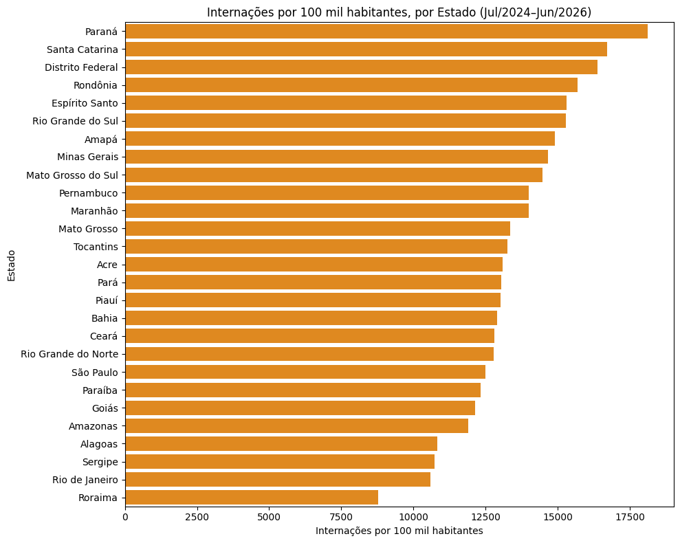
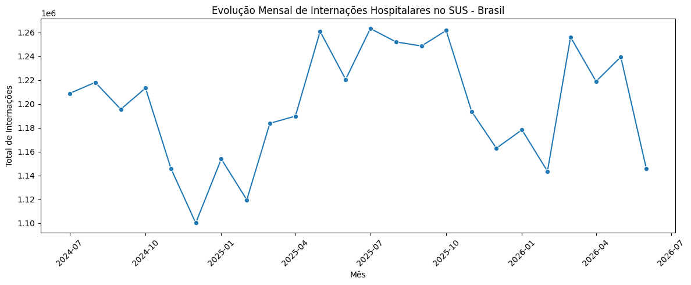

# InfoSUS

**Análise exploratória de internações hospitalares do SUS com 
Python, Pandas e SQL** — projeto de portfólio para candidatura em Dados.

Este projeto analisa as internações hospitalares do SUS por estado, 
usando dados do TabNet, no período de 2 anos (Jul/2024–Jun/2026).

## Objetivo

O objetivo é entender se os estados com mais internações realmente 
têm maiores problemas de saúde, ou se isso é apenas reflexo do 
tamanho da população de cada estado.

## Fonte dos Dados

Dados extraídos do TabNet/DATASUS, sistema "Morbidade Hospitalar 
do SUS - por local de internação - Brasil", indicador "Internações 
por Unidade da Federação e Ano/mês processamento".

Dados de população: estimativas do IBGE (referência 2024).

## Perguntas que guiaram a análise

1. Como evoluiu o volume de internações no Brasil mês a mês?
2. Quais estados concentram mais internações — em termos 
   absolutos e proporcionais à população?
3. Existe padrão sazonal nas internações?
4. Quais estados tiveram maior crescimento/queda no período?

## Metodologia

Os dados foram extraídos do TabNet/DATASUS em formato de planilha, 
o que facilitou o processo de limpeza. Durante essa etapa, foram 
identificados meses incompletos (dado mais recente ainda em 
processamento) e um indicador inicialmente incorreto, que precisou 
ser reextraído.

A estrutura da tabela foi reorganizada por região, para investigar 
se estados com clima mais frio apresentavam aumento de internações 
no inverno.

Os dados também foram cruzados com estimativas populacionais do 
IBGE, permitindo calcular a taxa de internação por 100 mil 
habitantes — métrica que possibilita comparar estados de tamanhos 
diferentes de forma justa.

Ferramentas utilizadas: Python, Pandas e SQL.

## Principais Insights

- O volume de internações muda significativamente quando dividido 
  pela população de cada estado — o ranking por número absoluto é 
  bem diferente do ranking proporcional.
  - São Paulo lidera em número absoluto de internações, mas cai para 
  posição intermediária quando ajustado pela população. Paraná, 
  Santa Catarina e Distrito Federal têm as maiores taxas por 100 
  mil habitantes, mesmo não liderando em volume bruto.
- Amapá, Amazonas e Tocantins tiveram os maiores aumentos 
  percentuais de internações no período; Rondônia e Maranhão, as 
  maiores quedas.
- A hipótese de que estados mais frios teriam mais internações no 
  inverno (por gripe, por exemplo) não se confirmou. O padrão 
  parece depender mais das condições específicas de cada região do 
  que de uma regra geral de sazonalidade.
  

## Limitações

- O dado tem granularidade estadual, o que esconde eventos 
  localizados. Um exemplo: um surto de conjuntivite no interior do 
  Rio de Janeiro não aparece no volume de internações do estado — 
  em parte porque conjuntivite raramente exige internação (é 
  tratada de forma ambulatorial), e em parte porque o evento é 
  pequeno demais frente ao total do estado.
- O estado de Roraima apresentou uma queda atípica em maio/2026 
  (de cerca de 3.000 para 352 internações), destoando fortemente 
  do padrão histórico do estado — provável atraso de consolidação 
  de dado, não uma queda real. Por isso, foi tratado com cuidado 
  nas análises de variação.
  
## Tecnologias

Python · Pandas · Matplotlib · Seaborn · SQL (SQLite) · Google Colab

## Como executar

1. Abra o notebook em `notebooks/analise_internacoes_sus.ipynb` no Google Colab
2. Faça upload dos arquivos CSV da pasta `data/`
3. Execute as células em ordem

---

**Autora:** Ludmilla Marques  
[LinkedIn](www.linkedin.com/in/ludmilla-6a32a91b) · [GitHub](https://github.com/ludmarques)
